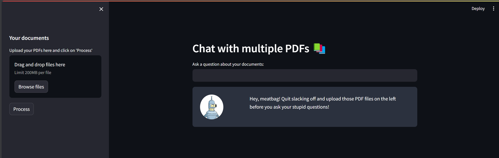

## GPT PDF Assist
A GPT based web-app build with LangChain. You can upload multiple PDF files and the GPT answers your questions with the context of uploaded PDF files.

### Interface
The web interface is made with Streamlit. You can upload multiple PDF files and ask questions regarding the content of uploaded PDF files. 



### How to run?
1. Create a file with name `.env` in the current directory.
2. Enter a valid OpenAI API key with in the format `OPENAI_API_KEY=xYz` and keep it inside the `.env` file.
3. Execute the app.py file using the command:
```python
streamlit run app.py
```

### Dependencies
You will need the following dependencies to run this application.
```python
pip install streamlit pypdf langchain faiss-cpu openai
```
